# Hello there! 👋 I'm Yahya

<div align="center">
  
</div>

<div align="center" style="margin-top: 15px; margin-bottom: 15px;">
  
[](https://git.io/typing-svg)

</div>

## 👨‍💻 About Me

```typescript
const YahyaZekry = {
  role: "React Developer & AI Framework Engineer",
  location: "Egypt 🇪🇬",
  currentFocus: "Building intelligent systems & scalable UIs",
  fuelSource: "Yerba Mate 🧉",
  passion: "Transforming LLMs into domain-focused solutions",

  techStack: {
    frontend: [
      "React",
      "React Native",
      "TypeScript",
      "Next.js",
      "Tailwind CSS",
    ],
    backend: ["Node.js", "Python", "tRPC", "Prisma", "NextAuth.js"],
    ai: [
      "LangChain",
      "Prompt Engineering",
      "LLM Integration",
      "Framework Architecture",
    ],
    mobile: ["React Native", "Expo"],
    tools: ["Git", "VS Code", "Webpack", "Jest", "Linux", "Bash", "Conky"],
  },

  dailyRoutine: ["Code", "Yerba Mate", "Architect", "Deploy"],
  philosophy:
    "if (bug.exists) { blame.yerbaMate = false; blame.logic = true; }",
};
```

<div align="center" style="margin-top: 10px; margin-bottom: 10px;">

🚀 **Fueled by Yerba Mate** | 🧉 **Code, Sip, Repeat** | 💡 **Design. Debug. Deploy.**

</div>

---

## 🎯 What I'm Building

<div align="center" style="margin-top: 10px; margin-bottom: 10px;">
  


</div>

### 🤖 **AI Framework Engineering**

- **Intelligent Instruction Systems** - Building AI frameworks that adapt and learn
- **Multi-modal AI Integration** - Seamlessly connecting LLMs with real-world applications
- **Ethical AI Boundaries** - Ensuring responsible AI development and deployment

### 🌐 **Full-Stack Development**

- **React Ecosystems** - Creating scalable, maintainable frontend architectures
- **T3 Stack Mastery** - Next.js, NextAuth.js, Prisma, tRPC, Tailwind CSS
- **Type-Safe APIs** - Building robust backend systems with full type safety

---

## 🚀 Featured Projects

<div align="center" style="margin-top: 10px; margin-bottom: 10px;">
  ✨
</div>

### 🔐 **[R3d.Hacker Framework](https://github.com/YahyaZekry/R3d.hacker)**

> 🎯 **Adaptive Cybersecurity AI Mentor**

```yaml
Tech Stack: Claude/GPT Integration, Markdown KB, Multi-tier Learning
Features:
  - Adaptive learning pathways
  - Ethical boundary enforcement
  - Progressive skill assessment
  - Interactive cybersecurity training
```

### 🕌 **[NLP Islamic Coach](https://github.com/YahyaZekry/NLP-Islamic-Coach)**

> 🌟 **AI-Powered Spiritual Guidance System**

```yaml
Innovation: NLP + Islamic Psychology + Meta-States Methodology
Components:
  - Personalized coaching protocols
  - Transformational interventions
  - User profiling & progress tracking
  - Cinema Mind technology integration
```

### 📚 **[Arabic Grammar Master](https://github.com/YahyaZekry/arabic-grammar-system)**

> 🎓 **Intelligent Language Learning Platform**

```yaml
Specialization: Quranic Arabic + Classical Grammar
Features:
  - Precise Quranic text parsing
  - Real-time error correction
  - Integrated Arabic dictionary
  - Interactive Q&A system
```

### 🏋️ **[SuperFunctional Training](https://github.com/YahyaZekry/functional_training-framework)**

> 💪 **SaaS Training Platform** (In Development)

```yaml
Architecture: T3 Stack (Next.js, NextAuth.js, Prisma, tRPC)
Current Phase:
  - Authentication & authorization flows
  - Database schema design
  - Type-safe API development
  - Responsive UI components
```

---

## 💡 My Creations

A couple of tools I've built to solve problems and share with the community:

<br>

<details>
<summary><strong>📊 Internet Usage Monitor (Bash, Conky)</strong></summary>
<br>
A shell-based utility for Linux to track and display internet data consumption in real-time, featuring a customizable Conky widget and usage notifications. Auto-detects network interfaces and supports daily limits.
<p align="right" style="margin-top: 5px;"><a href="https://github.com/YahyaZekry/internet-usage-monitor" target="_blank">View on GitHub ➔</a></p>
</details>

<br>

<details>
<summary><strong>🎨 Obsidian Mermaid to Excalidraw (TypeScript, Obsidian API)</strong></summary>
<br>
An Obsidian plugin that converts Mermaid.js diagram code blocks into fully editable Excalidraw drawings, preserving text labels and supporting various diagram types. Features bulk conversion and seamless Excalidraw plugin integration.
<p align="right" style="margin-top: 5px;"><a href="https://github.com/YahyaZekry/obsidian-mermaid-to-excalidraw" target="_blank">View on GitHub ➔</a></p>
</details>

<br>

---

## 🌟 React Showcase

<table>
<tr>
<td width="50%" style="padding: 10px;">

### 🔍 **[GitHub SearchEngine](https://github.com/YahyaZekry/github-searchEngine)**

Real-time GitHub profile explorer with advanced search capabilities and user analytics.

**Tech:** React, REST API, Pagination, Real-time Search

</td>
<td width="50%" style="padding: 10px;">

### ✈️ **[Travel List](https://github.com/YahyaZekry/travel-list)**

Smart packing list manager with drag-and-drop functionality and local persistence.

**Tech:** React, LocalStorage, State Management, UX Design

</td>
</tr>
<tr>
<td width="50%" style="padding: 10px;">

### 🍕 **[Perfect Pizza Place](https://github.com/YahyaZekry/pizza-menu)**

Dynamic restaurant ordering system with real-time updates and responsive design.

**Tech:** React, State Management, Component Architecture

</td>
<td width="50%" style="padding: 10px;">

### 💰 **[Eat'n Split](https://github.com/YahyaZekry/eat-n-split)**

Intelligent bill-splitting calculator with multi-currency support and tip suggestions.

**Tech:** React, Math Calculations, Friend Management System

</td>
</tr>
</table>

---

## 🛠️ Tech Arsenal

<div align="center" style="margin-top: 10px; margin-bottom: 10px;">

### **Frontend Development**


### **Styling & UI Libraries**


### **Backend & Full-Stack**


### **APIs & Data**


### **AI & Machine Learning**


### **Development Tools & Practices**


### **Testing & Build Tools**


### **Methodologies & Practices**


</div>

---

## 📊 GitHub Analytics

<div align="center" style="margin-top: 10px; margin-bottom: 10px;">
  
  
</div>

<div align="center" style="margin-bottom: 10px;">
  
</div>

---

## 🎯 Current Focus

```mermaid
graph TD
    A[🧉 Yerba Mate] --> B[💻 Code Quality]
    B --> C[🤖 AI Integration]
    C --> D[🚀 Innovation]
    D --> E[🌟 Impact]
    E --> A
    
    style A fill:#05a42f,stroke:#333,stroke-width:2px
    style B fill:#6B9BD2,stroke:#333,stroke-width:2px
    style C fill:#9B7EDE,stroke:#333,stroke-width:2px
    style D fill:#F093FB,stroke:#333,stroke-width:2px
    style E fill:#F5576C,stroke:#333,stroke-width:2px
```

<div align="center" style="margin-top: 10px; margin-bottom: 10px;">
  


</div>

### 🔥 **Active Development**

🚧 **SuperFunctional Training SaaS** - Full-stack training platform with T3 Stack  
📱 **Habit Tracker App** - Mobile app for building positive habits (React Native, Expo)  
🤖 **Frontend Mentor AI Framework** - Systematic web development guidance system  
📚 **Arabic Grammar Teacher AI** - Comprehensive language instruction framework  
🎨 **Component Library v2** - Advanced React components with TypeScript

### 🎯 **Learning Path**

🌱 **Currently Exploring:** Advanced AI architectures, Serverless deployment, Web3 integration  
📖 **Reading:** Clean Architecture, System Design, AI Safety protocols  
🎓 **Next Goals:** AWS Solutions Architect, Advanced TypeScript patterns

---

## ☕ Fun Facts

<div align="center" style="margin-top: 10px; margin-bottom: 10px;">
  ✨
</div>

- 🧉 **Yerba Mate Enthusiast** - My coding fuel of choice! Traditional Argentine style preferred
- 🌍 **Located in Egypt** but building solutions for the global community
- 🎯 **Perfectionist** - Believe in clean code and elegant solutions
- 📚 **Continuous Learner** - Always exploring new technologies and methodologies
- 🤝 **Collaboration Lover** - Open source contributor and team player
- 🎨 **Design Conscious** - Care deeply about UX/UI and accessibility
- ⚡ **Fast Learner** - Adapt quickly to new frameworks and technologies

---

## 🤝 Let's Connect!

<div align="center" style="margin-top: 10px; margin-bottom: 10px;">

[](https://www.linkedin.com/in/yahyazekry/)
[](mailto:yahyazekry@gmail.com)

</div>

<div align="center" style="margin-top: 15px; margin-bottom: 15px;">
  <a href="https://buymeacoffee.com/yahyazekry" target="_blank"></a>
  <p style="margin-top: 5px; font-size: 0.9em; color: #C9D1D9;">
    <i>I had fun making tools to work around problems I faced—never imagined they'd help others, but they have. That encouraged me to keep developing and sharing them. Now, with a little yerba mate to keep me company, I work on these tools for the benefit of all. People are in control.</i>
  </p>
</div>

<div align="center" style="margin-top: 10px; margin-bottom: 10px;">
  
### 💬 **"With enough Yerba Mate, any bug is fixable."**

**Available for freelance projects and collaboration opportunities!**  
Let's build something amazing together! 🚀

</div>

---

<div align="center" style="margin-top: 20px; margin-bottom: 20px;">
  
  <br><br>
  <p style="font-size: 0.9em; color: #C9D1D9;"><i>If you find my work helpful, consider starring a repo or two!</i> ✨</p>
</div>
